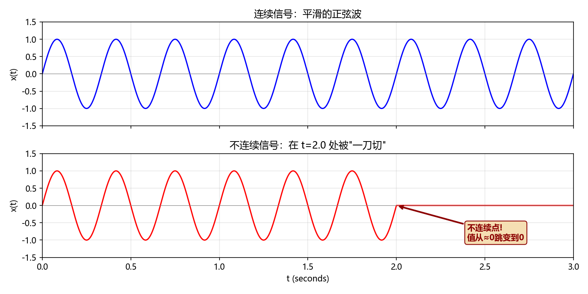
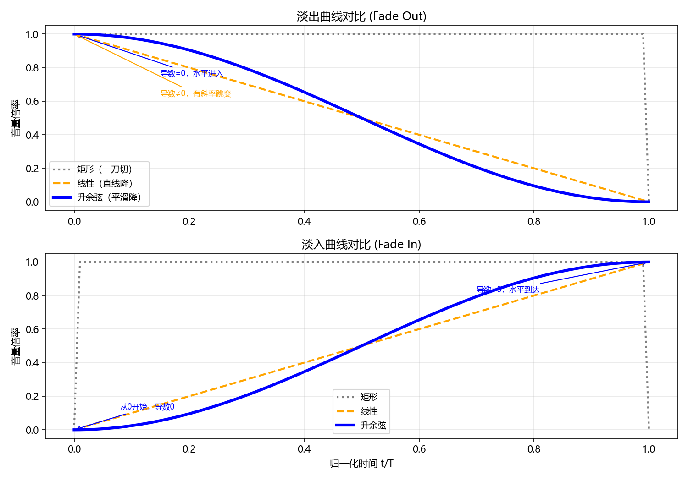
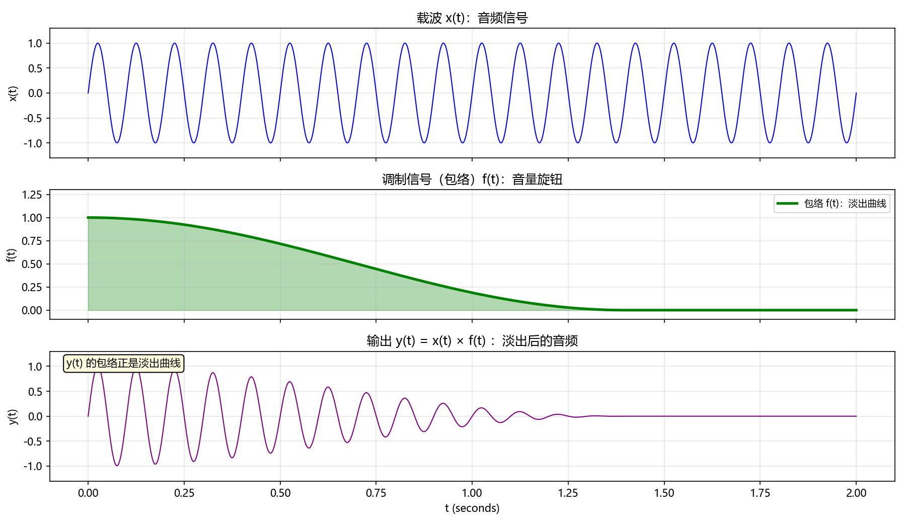
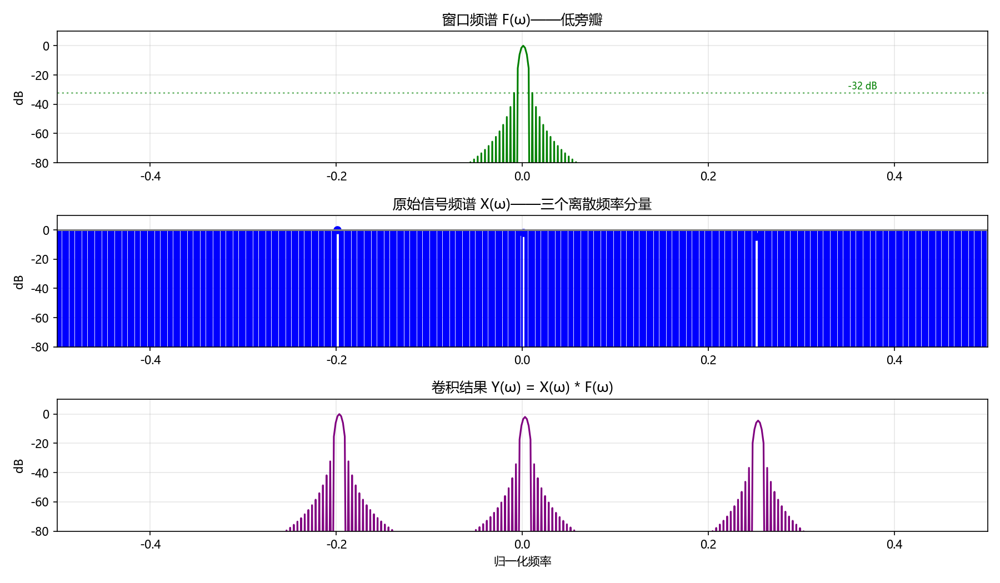
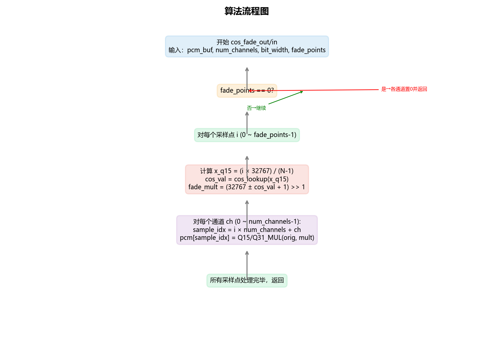

# cos_fader_demo

**Raised-cosine audio fade-in / fade-out library for the Andes NDS32 DSP platform.**

Smooth volume transitions that eliminate the click/pop artifacts — from pure mathematics down to single-cycle DSP intrinsics.

---

## Why "click" sounds bad

Cutting a waveform to zero in a single sample creates a wideband impulse — your ear hears a "pop."



A linear fade fixes the amplitude jump, but the **slope still jumps** at the boundaries, producing a quieter click.



The **raised-cosine window** goes further: both value **and** slope are continuous at both endpoints.

| Fade type | C⁰ continuous | C¹ continuous | Audible |
|-----------|:---:|:---:|:---:|
| Hard cut (rectangular) | No | No | Loud click |
| Linear | Yes | No | Subtle click |
| **Raised cosine** | **Yes** | **Yes** | **Silent** |


---

## The math

```
fade-out:  f(t) = [1 + cos(π · t / T)] / 2    (1 → 0)
fade-in:   f(t) = [1 − cos(π · t / T)] / 2    (0 → 1)
```

Both curves have **zero derivative at the boundaries**:

```
f'(t) = ∓(π / 2T) · sin(π · t / T)
f'(0) = 0,    f'(T) = 0      ✓ proof
```


---

## Frequency domain: why sidelobes matter

Multiplying a signal by an envelope is **amplitude modulation (AM)**.



In the frequency domain, multiplication = **convolution** of spectra: each frequency component gets "smeared" by the envelope's spectrum.




| Window | Peak sidelobe | Decay |
|--------|:---:|:---:|
| Rectangular | −13 dB | Slow |
| Triangular | −27 dB | Medium |
| **Raised cosine (Hann)** | **−32 dB** | **Fast** |

Lower sidelobes = less spectral leakage = cleaner audio.


---

## Fixed-point: Q15 & Q31

Embedded DSP chips have no FPU. We use fixed-point math:


| Format | Integer range | Real value = int / |
|--------|:---:|:---:|
| **Q15** | [−32768, 32767] | 2¹⁵ = 32768 |
| **Q31** | [−2³¹, 2³¹−1] | 2³¹ = 2147483648 |

**DSP instructions** do Q15/Q31 multiply in **1 clock cycle**:

```c
// Q15 × Q15 → Q15  (saturated, rounded)
buf[si] = __nds32__khmbb(buf[si], fade_mult);

// Q31 × Q31 → Q31
buf[si] = __nds32__kwmmul(buf[si], fade_q31);
```

---

## LUT with linear interpolation

A 257-entry cosine table with linear interpolation replaces `cos()` — no floating point needed.


```c
// Only integer shifts and multiplies — max error < 0.0001
uint32_t idx_frac = x_q15 << 8;             // ×256 via shift
uint16_t idx  = idx_frac >> 15;             // table index
uint16_t frac = idx_frac & 0x7FFF;          // interpolation fraction
int16_t y = y0 + ((frac * (y1 - y0) + 2¹⁴) >> 15);
```

---

## Bresenham angle accumulator: zero divisions

Instead of `angle[i] = (i × 32767) / (N−1)` — a slow 32-bit divide per sample — we use **incremental accumulation**:

```c
angle_init:  delta_base = 32767 / denom     // done once
             rem_step   = 32767 % denom

angle_next:  x_q15  += delta_base
             rem    += rem_step
             if (rem >= denom) { x_q15++; rem -= denom; }
             return x_q15
```

**Zero LSB error** — exhaustively verified against the division formula for all N = 1..65536. Saves ~20–35 clock cycles per sample, freeing **~1.7 MIPS** at 48 kHz.



---

## Implementation variants

| Source file | Cosine source | Angle computation | ROM | Per-sample cycles |
|---|---|---|---|---|
| `cos_fade.c` | LUT (257 × 2 bytes) | Division per sample | 514 B | ~8–12 |
| `cos_fade_fast.c` | LUT + DSP `smmul_u` | Bresenham | 514 B | ~8–12 |
| `cos_fade_dsp.c` | DSP library `cos_q15` | Division per sample | **0** | ~70–135 |
| **`cos_fade_dsp_fast.c`** ★ | DSP library `cos_q15` | **Bresenham** | **0** | **~50–115** |

**Decision guide:**

```
                 Need zero ROM?
                /            \
              Yes              No
              │                └─ 514 B OK? ── cos_fade.c (recommended)
              │
         Accept slightly
         higher CPU?
         /        \
       Yes         No
        │           │
   cos_fade_dsp   cos_fade_dsp_fast ★
```

---

## Cross-frame fader (`cos_fader`)

Real audio systems deliver PCM in blocks (128/256/512 samples per frame). `cos_fader.c` wraps a state machine that resumes across arbitrary boundaries:

```c
CosFaderContext fader;
cos_fader_init(&fader, 2, 16, COS_FADER_FADE_OUT, 44100);

while (!cos_fader_is_done(&fader)) {
    read_frame(pcm_in, 128);
    cos_fader_apply(&fader, pcm_in, pcm_out, 128);
    write_frame(pcm_out, 128);
}
// After completion: auto-holds silence (fade-out) or passthrough (fade-in)
```

Features: 16/24/32-bit PCM, interleaved multi-channel, in-place capable, full error code returns.

---

## PCM formats

| Bit width | Storage | DSP instruction | Notes |
|---|:---:|:---:|---|
| 16-bit | `int16_t[]` | `khmbb` | Q15 × Q15 |
| 24-bit | `int32_t[]` right-aligned | `kwmmul` | Mask + sign-extend bit 23 |
| 32-bit | `int32_t[]` | `kwmmul` | Q31 × Q31 |

---

## Quick start

```bash
# Generate cosine LUT
python scripts/gen_cos_table.py

# Run verification
python scripts/test_fade.py

# Include in your project
#   LUT version:    src/cos_fade.h + src/cos_fade.c + src/cos_table.inc
#   DSP version:    src/cos_fade.h + src/cos_fade_dsp_fast.c
#   Context fader:  src/cos_fader.h + src/cos_fader.c
```

```c
#include "cos_fade.h"

// 16-bit stereo, fade out over first 44100 per-channel samples
cos_fade_out(pcm_buffer, 2, 16, 44100);

// 32-bit mono, fade in over first 22050 samples
cos_fade_in(pcm_buffer, 1, 32, 22050);
```

---

## Project layout

```
├── src/               Core C library (5 implementations)
├── scripts/           Python verification + MATLAB simulation
├── docs/              Tutorial (in Chinese) + DSP library manual
├── figures/           All diagrams and test outputs
└── README.md
```

---

## Platform

- **Target**: Andes NDS32 DSP (RV32-like ISA)
- **Intrinsics**: `__nds32__khmbb`, `__nds32__kwmmul`, `__nds32__smmul_u`
- **Reference**: Andes DSP Library v3 User Manual (see `docs/`)

---

## Further reading

See [docs/fade_tutorial.md](docs/fade_tutorial.md) for an in-depth tutorial covering:
- Derivatives and Cⁿ continuity
- AM modulation and convolution
- Fixed-point Q15/Q31 arithmetic
- LUT design and linear interpolation
- Bresenham accumulator proof
- 24-bit PCM pitfalls
- Why Chebyshev recurrence was rejected
