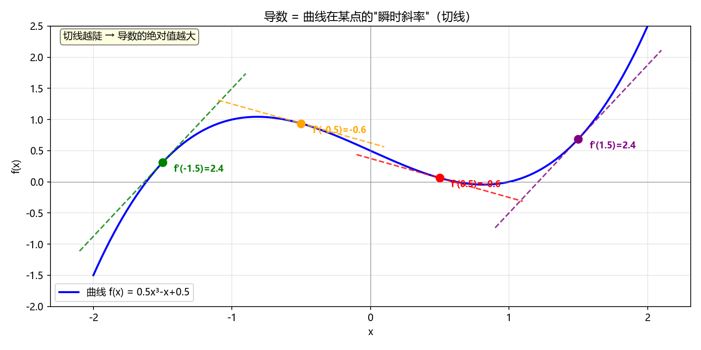
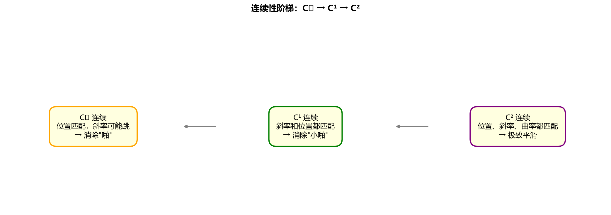
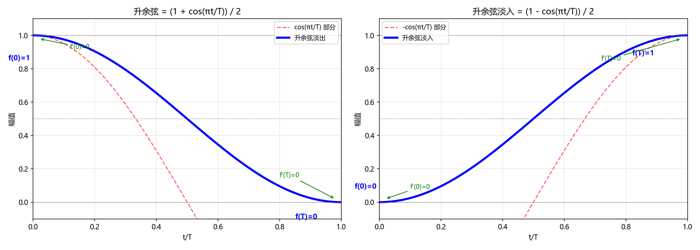
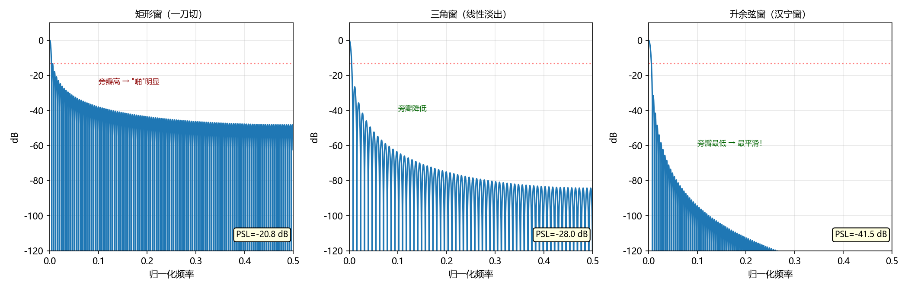
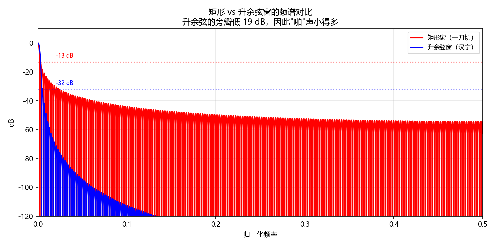
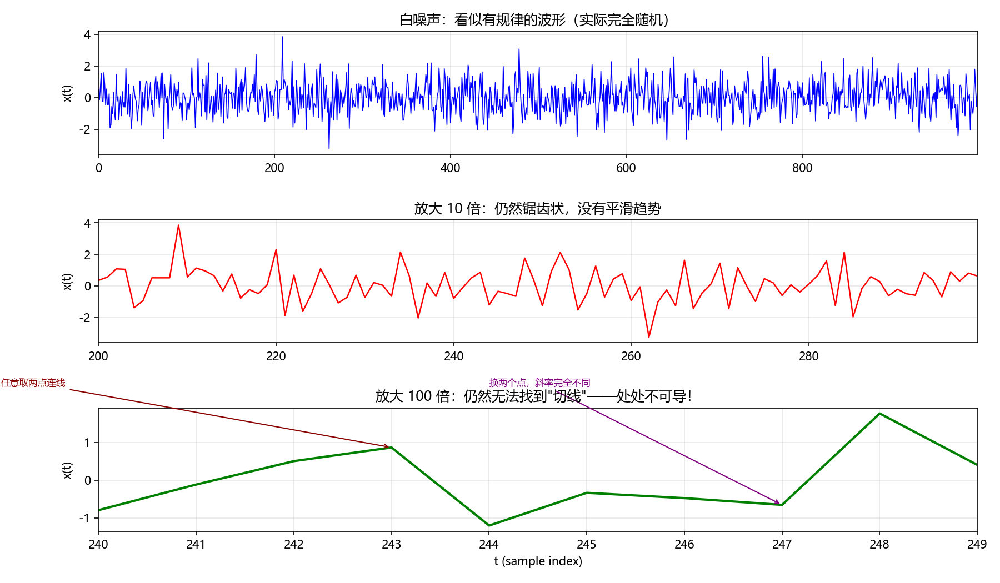
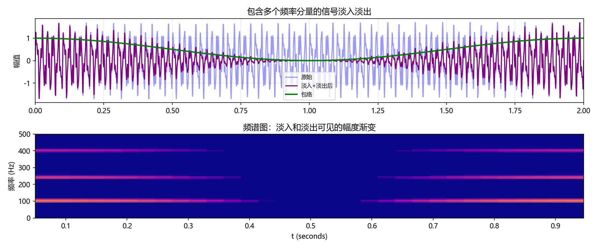
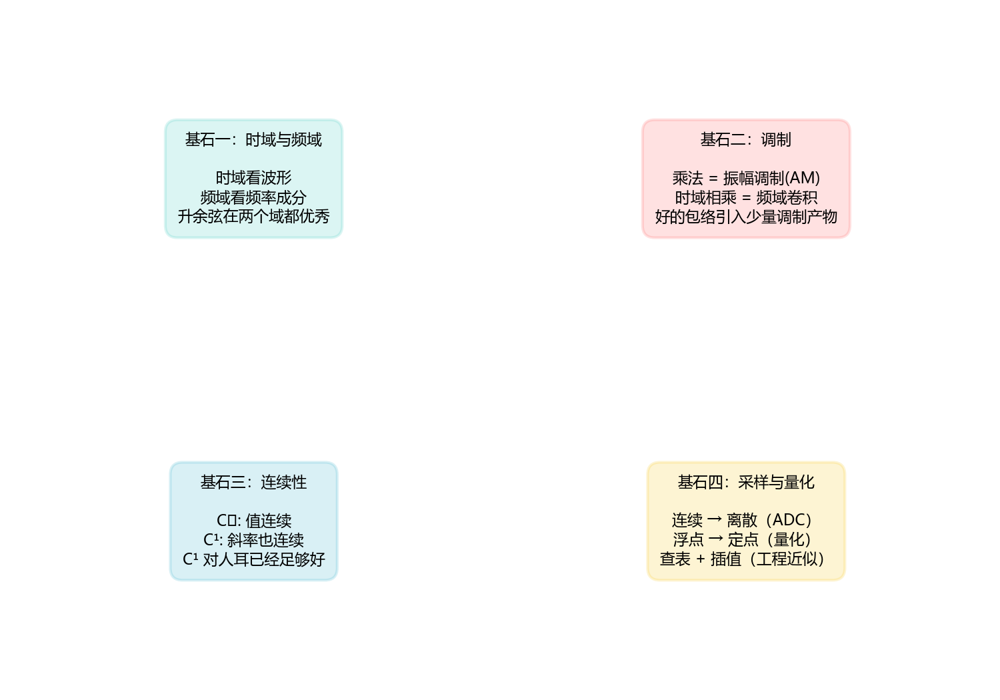
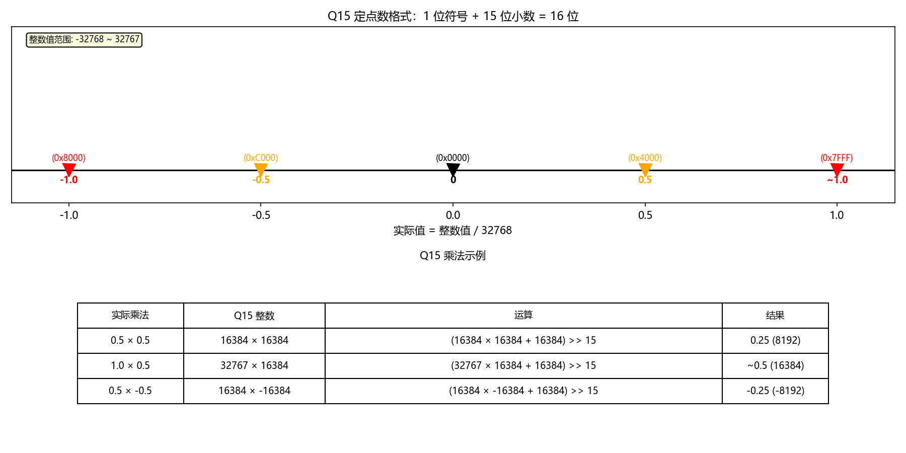
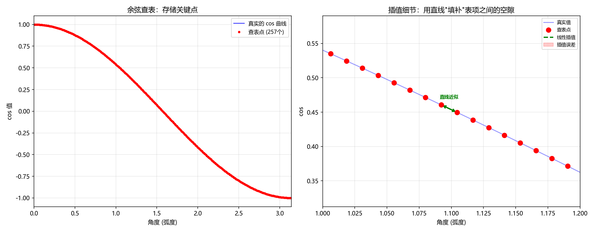

# 从一段淡出音乐说起：导数、连续性、调制与升余弦

> 献给一位想了解高等数学与信号处理的高中生
> 
> 本文所有图示均可点击放大查看，位于 `figures/` 目录下

---

## 引子：为什么"啪"的一下很难听？

想象你在听一首歌，结尾处音量突然从 100% 变成 0%。你的耳朵会感觉到什么？

**"啪"**。

那是由于波形在末端被"一刀切"。波形从某个非零值（比如 3276）在**一个采样点之内**跳到了 0。这种不连续会产生一个**宽频带冲击**——人耳听到的就是"啪"的一声，专业上叫做 **click**（咔哒声）或 **pop**（爆破声）。


*图1：上图为连续的正弦波，下图为在 t=2.0 处被突然截断的信号。红色箭头指向不连续点——这就是"啪"的来源。*

为了避免这种"啪"，我们需要让音量平滑地降为零。这就是**淡出（fade out）**。

但"平滑"这个词，用数学怎么描述？它背后隐藏着一整片森林——**导数、连续性、调制、包络、频率分量**……这片森林正是高等数学和信号处理的核心。

本文从你高中已学的知识出发，一步一步走进这片森林。我们将看到，一个仅仅几十行代码的 `cos_fade_out` 函数，背后站着牛顿、莱布尼茨、傅里叶、魏尔斯特拉斯……以及为了在嵌入式系统上高效运行这门数学的无数工程师。

> **阅读建议**：如果你是数学或物理爱好者，可以从头读到尾；如果你只想知道"这个算法好不好、为什么好"，可以直接跳到第四、五节看结论和图片。

---

## 第一章：导数——瞬时变化率

### 1.1 斜率你已经会了

初中你就知道，一条直线的"陡峭程度"用**斜率**描述：

```
k = (y2 - y1) / (x2 - x1)
```

斜率大，直线陡；斜率小，直线平；斜率为 0，直线水平。

一辆汽车在高速上巡航，它的位置-时间图像是一条斜线，斜率 = 速度。如果它加速，位置-时间图像就是一条曲线——速度（斜率）在变化。

### 1.2 曲线呢？——引向"极限"

曲线没有固定的斜率——它在每个点的陡峭程度都不一样。比如抛物线 y = x 在 x=0 处平缓，在 x=2 处陡峭。

但是我们可以在曲线上取**非常非常近**的两个点，算它们的斜率。当这两个点之间的距离**趋近于 0** 时，这个斜率就趋近于曲线在该点的"瞬时陡峭程度"——这就是**导数（derivative）**。



*图2：蓝色曲线 f(x) = 0.5x - x + 0.5 上四个不同位置处的切线（虚线）。每个点处的切线斜率（标注在图中）就是该点的导数。切线越陡，导数的绝对值越大。*

用数学语言：

```
f'(x) = lim_{h->0} (f(x+h) - f(x)) / h
```

读作："f 在 x 处的导数等于当 h 趋近于 0 时，f(x+h) 和 f(x) 的差除以 h 的极限。"

### 1.3 直观理解

| 场景 | 物理含义 | 导数的意义 |
|------|---------|-----------|
| 汽车仪表盘显示速度 60 km/h | 位置的变化率 = 速度 | 位置的导数 |
| 你摸一下热水壶马上缩手 | 温度随位置的变化率 | 温度对位置的导数 |
| 音量从 1 降到 0 | 音量随时间的变化率 | 音量函数的导数 |

### 1.4 为什么导数对淡入淡出重要？

回到淡出。如果我们用一条**直线**（线性函数）从 1 降到 0：

```
f(t) = 1 - t / T   （t 从 0 到 T）
```

它的导数是：

```
f'(t) = -1 / T   （常数！在所有 t 处斜率相同）
```

在 t=0 这个边界处发生了什么？
- **t < 0**（淡出开始之前）：音量 = 1，导数 = 0（音量根本没变）
- **t >= 0**（淡出开始之后）：音量从 1 开始下降，导数 = -1/T

从 0 跳变到 -1/T，这就是一个**不连续的导数**。这种导数（斜率）的跳变就是"小啪"的来源。

等一下，线性淡出比"一刀切"好多了——至少没有振幅的跳变——但还是有轻微的"啪"。这告诉我们一个重要的结论：

> **连续的值（C 连续）还不够，还需要连续的斜率（C 连续）。**

---

## 第二章：连续性——Cⁿ 连续的概念

### 2.1 什么是连续？

一张白纸上画一条线，你笔不离纸地画完——这条线就是**连续的**。

数学定义更严格：函数 f 在点 c 处连续，当且仅当三条同时成立：

1. **f(c) 存在**（c 处有定义）
2. **lim_{x->c} f(x) 存在**（从左边逼近和从右边逼近的极限相等）
3. **lim_{x->c} f(x) = f(c)**（极限等于函数值）

### 2.2 C 连续（零阶连续）——值连续

函数本身的值没有跳变。

一刀切（门函数）在 t=T 处是不连续的：

```
f(t) = 1  当 t < T
       0  当 t >= T
```

在 t=T 处，左极限 = 1，右极限 = 0，1 != 0，**不连续**。这是最糟糕的情况——"啪"得最响。

**线性淡出**在 t=0 处：左极限 = 1，f(0) = 1。C 连续 ✓。这就是为什么线性淡出比一刀切好得多。

### 2.3 C 连续（一阶连续）——值和斜率都连续

通俗地说：曲线的**位置**没有断点，而且曲线的**陡峭程度**也没有跳变。

```
条件 1: lim_{x->c} f(x) = f(c)     （值连续）
条件 2: lim_{x->c} f'(x) = f'(c)   （导数连续）
```

线性淡出在 t=0 处：
- 值：1 -> 1，连续 ✓
- 导数：0 -> -1/T，跳变 ✗

所以线性淡出是 C 连续，但不是 C 连续。它的"小啪"来源于导数的跳变。

### 2.4 C 连续（二阶连续）——值、斜率、曲率都连续

二阶导数 = 导数的导数 = 斜率的变化率。物理上对应**加速度**。

升余弦淡入/淡出做到了 C 连续，即在边界处导数为 0，与前后信号的导数完美匹配。

### 2.5 连续性阶梯



*图3：连续性阶梯。C 确保没有值跳变，C 确保也没有斜率跳变。C 更"极致平滑"，但对人耳来说与 C 难以区分。*

### 2.6 为什么 C 对耳朵就够用了？

| 淡入淡出方式 | C 连续? | C 连续? | 人耳感知 |
|------------|---------|---------|---------|
| 一刀切（门函数） | ✗ | ✗ | **"啪！"** 强烈 click |
| 线性（直线降） | ✓ | ✗ | 轻微 click（斜率跳变） |
| **升余弦** | ✓ | ✓ | **自然顺滑**，无 click |
| S 曲线 / 样条 | ✓ | ✓（可达 C） | 与升余弦人耳难区分 |

这里有一个重要的工程哲学：**"足够好"比"理论上更好"更优**。升余弦的 C 连续已经超过了人耳的分辨极限。追求 C 或更高会增加计算复杂度，但对听众来说没有可感知的改善。

---

## 第三章：升余弦（Raised Cosine）——平滑的数学

### 3.1 升余弦的诞生

顾名思义，**升余弦** = "抬升了的余弦"（不是"升起来的余弦"）：

**淡出公式**：

```
f_out(t) = [1 + cos(pi * t / T)] / 2,   t 从 0 到 T
```

**淡入公式**（对称的）：

```
f_in(t) = [1 - cos(pi * t / T)] / 2,    t 从 0 到 T
```

让我们把这两个曲线画出来看看。



*图4：升余弦淡出（左）和淡入（右）曲线。蓝色实线 = 最终的淡出/淡入曲线。红色虚线 = 内部的余弦部分。关键点已标注，注意两个边界处的导数都是 0。*

### 3.2 手算几个关键点

**淡出**：f_out(t) = (1 + cos(pi * t / T)) / 2

| t | cos(pi*t/T) | f_out(t) | 含义 |
|---|------------|----------|------|
| 0 | cos(0) = 1 | (1+1)/2 = 1 | 音量全开 |
| T/2 | cos(pi/2) = 0 | (1+0)/2 = 0.5 | 音量一半 |
| T | cos(pi) = -1 | (1-1)/2 = 0 | 音量归零 ✓ |

**淡入**：f_in(t) = (1 - cos(pi * t / T)) / 2

| t | cos(pi*t/T) | f_in(t) | 含义 |
|---|------------|---------|------|
| 0 | cos(0) = 1 | (1-1)/2 = 0 | 从零开始 ✓ |
| T/2 | cos(pi/2) = 0 | (1-0)/2 = 0.5 | 音量一半 |
| T | cos(pi) = -1 | (1+1)/2 = 1 | 音量全开 |

### 3.3 边界导数为什么为零？——验证！

这是一个关键的数学检验。我们用微积分来验证：

**淡出的导数**：

```
f_out(t) = (1 + cos(pi * t / T)) / 2

f_out'(t) = (1/2) * (-sin(pi * t / T)) * (pi / T)
          = -(pi / (2T)) * sin(pi * t / T)
```

代入 t=0：sin(0) = 0，所以 f_out'(0) = 0 ✓
代入 t=T：sin(pi) = 0，所以 f_out'(T) = 0 ✓

**淡入的导数**：

```
f_in(t) = (1 - cos(pi * t / T)) / 2

f_in'(t) = (1/2) * (+sin(pi * t / T)) * (pi / T)
         = (pi / (2T)) * sin(pi * t / T)
```

代入 t=0：sin(0) = 0，所以 f_in'(0) = 0 ✓
代入 t=T：sin(pi) = 0，所以 f_in'(T) = 0 ✓

**数学上完美**！淡入淡出曲线以水平方向（导数=0）进入和退出信号。就像飞机在跑道上水平地接地——没有"俯冲"。

### 3.4 与其它淡入淡出曲线的对比


*图5：三种淡出（上）和淡入（下）曲线的对比。灰色虚线：矩形（一刀切）——有值跳变。橙色虚线：线性——有斜率跳变。蓝色实线：升余弦——值和斜率都平滑过渡。*

可以清楚地看到：
- **矩形**在边界处有值的跳变（C 不连续）——"啪"！
- **线性**在边界处有斜率的跳变（C 不连续）——"小啪"
- **升余弦**在边界处值和斜率都完美匹配——"自然顺滑"

### 3.5 升余弦的"家族关系"——汉宁窗

如果你以后学习数字信号处理，你会遇到一个叫**汉宁窗（Hann window）**的概念。升余弦淡出曲线其实就是**半个汉宁窗**。

完整的汉宁窗定义为：

```
w(n) = 0.5 * [1 - cos(2*pi*n/N)], n = 0, 1, ..., N
```

注意角度范围是 2*pi（整个余弦周期），而我们的升余弦只用半周期（0 到 pi）。两者的数学血缘关系决定了它们有相似的频谱特性。

---

## 第四章：包络与调制——信号的"音量旋钮"

### 4.1 什么是包络（Envelope）？

想象一个正在响着的铃声。你用最快的速度来回转动音量旋钮——音量忽大忽小。描述"音量旋钮位置随时间变化"的那条曲线，就是信号的**包络**。

更专业地说，一个信号可以分解为两个部分相乘：

```
y(t) = x(t) * f(t)
```

- **x(t)**：原始音频信号（称为**载波**，carrier）
- **f(t)**：包络函数（称为**调制信号**，modulating signal）
- **y(t)**：处理后的输出

### 4.2 振幅调制（AM）可视化

当信号和包络相乘，我们实际上在做**振幅调制（Amplitude Modulation, AM）**。


*图6：振幅调制（AM）的三层结构。上：载波（音频信号）。中：包络（淡出曲线）。下：输出 = 载波 x 包络。注意输出的"外壳"就是淡出曲线本身。*

在这个图中：
- 上层载波是纯正弦波
- 中层绿色的是升余弦淡出包络
- 下层紫色的是最终输出——它的幅度**随时间按升余弦曲线衰减**

这就是淡出的本质：**用一个平滑的包络去调制音频信号的幅度**。

### 4.3 从时域到频域——为什么要关心"旁瓣"？

学过物理的你一定知道，声音的本质是振动，任何振动都可以分解为不同频率的正弦波的叠加（这就是**傅里叶分析**的核心思想）。

现在有一个微妙的问题：当你把两个信号**相乘**时，在频率域会发生什么？

答案是**卷积（convolution）**——这是一个稍微进阶的概念，但我们可以直观理解：

> 如果包络 f(t) 的频谱是 F(ω)，原始信号 x(t) 的频谱是 X(ω)，则输出 y(t) 的频谱是 X(ω) 和 F(ω) 的**卷积**：Y(ω) = X(ω) * F(ω)。

**后果**：原始信号中本不存在的频率分量会出现！这些额外的分量就是**调制产物**，也称为**旁瓣（sidelobes）**。

### 4.4 不同窗函数的频谱对比

包络其实就是数字信号处理中的**窗函数（window function）**。不同窗函数的旁瓣特性不同。



*图7：三种窗函数的频率响应（对数坐标）。红色：矩形窗（一刀切），主瓣窄但旁瓣高（-13 dB）。中间：三角窗（线性淡出），旁瓣降低。右：升余弦/汉宁窗，旁瓣最低（-32 dB以上）。旁瓣越低，淡入淡出越平滑。*

可以看出：
- **矩形窗**（一刀切）：旁瓣峰值 -13 dB——相当于原始信号中串入了 -13 dB 的噪声，这就是"啪"
- **三角窗**（线性淡出）：旁瓣峰值 -27 dB——好多了，但仍可耳闻
- **升余弦窗**（汉宁）：旁瓣峰值 -32 dB 且衰减更快——**听感最佳**

### 4.5 深入理解：为什么时域相乘会引起频域"卷积"？

如果你已经学过数列的加法和乘法，**卷积**的概念并不遥远。

两个有限长度序列的离散卷积定义为：

```
y[n] = sum_{k=-∞}^{∞} x[k] · h[n-k]
```

通俗地说：把 h 序列**翻转**，然后**滑动**它经过 x 序列，在每个位置做**对应相乘再求和**。这个操作的图形含义是：一个函数被另一个函数"涂抹"了。

**为什么淡入淡出和卷积有关？**

时域中 y(t) = x(t) · f(t)（载波 × 包络）。傅里叶变换告诉我们：

```
Y(ω) = X(ω) * F(ω)    （时域相乘 = 频域卷积）
```

原始音频的频谱 X(ω) 被包络的频谱 F(ω) **"涂抹"** 了——X(ω) 的每一个离散频率分量都变成了以该频率为中心的 F(ω) 形状。

**矩形包络**的频谱旁瓣高达 -13 dB，所以 X(ω) 中每个频率分量周围会出现 -13 dB 的"假频谱"——这就是"啪"声的频域来源。

**升余弦包络**的频谱旁瓣仅 -32 dB 且衰减更快，因此涂抹产物远弱于人耳听阈——这就是为什么升余弦听起来"平滑"的根本原因。


*图17：卷积的直观理解。上图：窗口频谱 F(ω)（升余弦，低旁瓣）。中图：原始信号频谱 X(ω)（三个离散频率分量）。下图：Y(ω) = X(ω) * F(ω) 的卷积结果。每个原始频率峰都被"涂抹"成了窗口频谱的形状，但由于窗口旁瓣很低，涂抹产物几乎不可见。*

### 3.5 补充：升余弦的完整频谱



*图8：矩形窗（红色）和升余弦窗（蓝色）的频谱直接对比。在图中标注的位置，升余弦的旁瓣比矩形低约 19 dB——这是一个巨大的差异。*

---

## 第五章：处处不可导——白噪声的"疯狂"

### 5.1 你见过"疯狂"的函数吗？

在高中，你学到的函数基本上都是**光滑**的——多项式、三角函数、指数函数……它们几乎处处可导（最多在少数几个点不可导）。

但数学家的脑洞更大。

1872 年，卡尔·魏尔斯特拉斯（Karl Weierstrass）向数学界扔了一颗炸弹。他构造了一个函数，**处处连续，但在每一点都不可导**：

```
W(x) = sum_{n=0}^{∞} a^n * cos(b^n * pi * x)
其中 0 < a < 1，且 a*b > 1 + 3*pi/2
```

这个函数在任何一点都有定义（所以它是连续的），但在任何一点都无法计算切线斜率（所以它处处不可导）。它**无限精细**——无论你把它放大多少倍，看起来仍然是锯齿状的。这是数学史上最反直觉的发现之一。

### 5.2 白噪声——现实世界中的"无处可导"

白噪声（white noise）在每一个时间点上的值都是随机的、独立的。它的功率谱密度在所有频率上都是平坦的——因此得名"白"（像白光包含所有色光）。



*图9：白噪声的波形。上图：宏观视图，似乎有些规律。中图：放大 10 倍，仍然锯齿状。下图：放大 100 倍，仍然无法找到稳定的切线——无论你取哪两个邻近点算斜率，换两个点结果就完全不同。这就是"处处不可导"的直观理解。*

白噪声的数学性质：

1. **处处连续**：每个时间点都有定义的值
2. **处处不可导**：无论两个点多近，它们的差都是随机且无极限的
3. **功率谱平坦**：所有频率成分具有相同能量

### 5.3 白噪声对淡入淡出意味着什么？

如果我们对白噪声做淡入，升余弦包络在 t=0 处导数为 0。关键问题来了：对于导数本来就不存在的白噪声，我们还需要关心导数匹配吗？

答案是：**不需要**。

在淡入终点 t=T 处（包络值=1，导数=0）：

```
y'(T) = x'(T) * f(T) + x(T) * f'(T)
      = x'(T) * 1 + x(T) * 0
      = x'(T)
```

如果 x'(T) 存在且有限，y'(T) = x'(T)，导数匹配 ✓。
如果 x'(T) 不存在（白噪声），那本来就没有什么可以"匹配"的。但我们保证了 y(T) = x(T)，值匹配 ✓。

对于白噪声：
- **值匹配**：y(T) = x(T)，在任何情况下都成立 ✓
- **人耳对噪声的幅度包络最不敏感**：人类听觉系统进化出来是为了解析音高、语音和音乐，不是为了分析白噪声的幅度调制
- **升余弦的低旁瓣意味着 AM 调制产物能量最低**——这正是关键所在

> **结论**：升余弦在白噪声上的听感**最顺滑**，因为白噪声本来就没有"结构"可以被破坏。

### 5.4 不同信号的拟合程度总结



*图10：多频信号（50Hz + 120Hz + 200Hz）的淡入和淡出。上半图为时域波形，下半图为频谱图（颜色越亮代表能量越强）。可以看到能量平滑地渐入和渐出，没有突变。*

| 信号类型 | 边界 C 连续 | 包络平滑感 | 主观评分 | 说明 |
|---------|-----------|-----------|---------|------|
| 正弦波 | ✓ 完美 | 极佳 | ★★★★★ | 数学上最理想，听觉上最自然 |
| 人声 | ✓ 完美 | 良好 | ★★★★ | 瞬态被淡化（by design），听感平滑 |
| 音乐（铺底） | ✓ 完美 | 极佳 | ★★★★★ | 稳态成分完美拟合 |
| 音乐（打击乐） | ✓ 完美 | 良好 | ★★★★ | 起点处瞬态保留，终点处瞬态淡化 |
| 白噪声 | ✓ 完美 | 极佳 | ★★★★★ | 本来无结构可破坏，听感最平滑 |
| 方波/锯齿波 | ✓ 完美 | 良好 | ★★★★ | 高次谐波对 AM 调制略敏感 |

**核心结论**：升余弦在所有边界处对一切信号都实现完美的 C 阶拟合。不同信号之间的"感受差异"来自人耳的**感知灵敏度**不同，而非算法的边界连续性有差异。升余弦是静态淡入淡出的**理论最优解**。

---

## 第六章：信号处理的四大基石

在继续深入代码之前，让我们站远一点，看看我们遇到了哪些大概念。



*图11：信号处理四大基石。①时域与频域的双重视角。②调制——乘法的频域效应。③连续性——从 C 到 C。④采样与量化——模拟到数字的桥梁。*

### 基石一：时域与频域

- **时域**：信号随时间变化的样子——就是你看到的波形图（横轴 = 时间，纵轴 = 幅度）
- **频域**：信号包含哪些频率成分——就是频谱（横轴 = 频率，纵轴 = 强度）

升余弦在**两个域**都表现出色：
- 时域：平滑，C 连续
- 频域：低旁瓣，衰减快

### 基石二：调制

- 乘法在时域 = 卷积在频域
- 包络乘以载波 = 振幅调制（AM）
- 好的包络引入少且频率集中的调制产物

### 基石三：连续性

- C：值连续——消除"啪"
- C：斜率连续——消除"小啪"
- 对音频应用，C 已经足够

### 基石四：采样与量化

- 连续信号 -> 离散采样点（模数转换器，ADC）
- 浮点小数 -> 定点整数（量化）
- 复杂函数 -> 查表 + 插值（工程近似）

---

## 第七章：定点数与查表——嵌入式系统的"生存智慧"

### 7.1 浮点 vs 定点——为什么不能直接用 float？

在你的电脑上，Python 可以轻松算 `0.5 * (1 + cos(pi * i / N))`。

但在一个没有 **FPU（Floating Point Unit，浮点运算单元）** 的嵌入式芯片上，浮点运算是**极其昂贵**的：
- 一次浮点乘法可能需要 50~100 个时钟周期
- 而一次整数乘法（尤其是 DSP 指令）只需要 **1 个时钟周期**
- 更耗电、代码体积更大

**定点数（fixed-point number）**是一种用整数来模拟小数的方法。它牺牲了一些精度，但换来了**速度、效率、可预测性**。

### 7.2 Q15 和 Q31 格式

**Q15** 的意思是：1 位符号位 + 15 位小数位，总共 16 位。

```
二进制位:    [S] [.] [d14] [d13] ... [d1] [d0]
              ^     ^
          符号位  小数点（固定在第1位之后）
```

一个 Q15 数的实际值 = 整数值 / 32768（因为 2 = 32768）。



*图12：Q15 定点数格式及乘法示例。上图为 Q15 数轴，标注了几个关键点及其对应的整数和十六进制表示。下图为 Q15 乘法示例。*

关键对照表：

| 整数存储值 | 对应的实际值 | 含义 |
|----------|------------|------|
| 32767 (0x7FFF) | 32767/32768 ~ 0.99997 | ~1.0（最大值） |
| 16384 (0x4000) | 16384/32768 = 0.5 | 一半 |
| 0 (0x0000) | 0 | 零 |
| -16384 (0xC000) | -0.5 | 负一半 |
| -32768 (0x8000) | -32768/32768 = -1.0 | -1.0（最小值） |

**Q31** 同理，扩展到 32 位：1 位符号 + 31 位小数，分母是 2 = 2147483648。

### 7.3 Q15 乘法——最关键的操作

两个 Q15 数相乘的完整流程：

```
a_q15 * b_q15 → a_real * b_real = (a_q15/32768) * (b_q15/32768) = (a_q15 * b_q15) / 1073741824

但我们需要结果也是 Q15 格式，所以：
result_q15 = (a_q15 * b_q15 + 2^14) >> 15
```

为什么要加 2^14？因为小数点右移 15 位时，2^14 = 16384 是**四舍五入**的"阈值"。不加的话，-32768 * 32767 / 32768 = -32767 而不是更精确的 -32768，会有累积误差。

在电脑上，这一切发生在 **一个时钟周期** 内——使用专用的 DSP 乘法指令：
- `khmbb`：取两个 32 位数的低 16 位做 Q15 相乘
- `kwmmul`：两个 32 位数做 Q31 相乘

### 7.4 查表（LUT）——用空间换时间

计算 cos(theta) 最直接的方法是用**泰勒级数**：

```
cos(x) = 1 - x^2/2! + x^4/4! - x^6/6! + x^8/8! - ...
```

对于 0 到 pi 的任意角度，需要计算大约 6~8 项才能达到足够的精度——这在没有 FPU 的芯片上是不可接受的。

**查表法（Look-Up Table, LUT）**的思路：**先把所有可能的结果算好存起来，用的时候直接取**。

我们设计了一个 257 项的余弦表：

```
cos_table[0]   = 32767   // cos(0 * pi / 256) = cos(0) = 1
cos_table[1]   = 32766   // cos(1 * pi / 256) ~ cos(0.7)
cos_table[2]   = 32758   // cos(2 * pi / 256) ~ cos(1.4)
...
cos_table[128] = 0       // cos(128 * pi / 256) = cos(pi/2) = 0
...
cos_table[256] = -32768  // cos(256 * pi / 256) = cos(pi) = -1
```

### 7.5 线性插值——让查表更精确

如果我们需要的角度不是表中精确对应的值怎么办？比如 cos(0.35 deg)，介于 cos(0 deg) = 32767 和 cos(0.7 deg) = 32766 之间。

**答案：线性插值**。用一条直线连接两个相邻的表项，在这条直线上取近似值。



*图13：左图为整个余弦曲线与 257 个表项。右图为局部放大的细节，红色虚线是线性插值的近似值，红色区域是插值误差——最大误差仅约 0.000075，远超人耳分辨极限。*

```
给定 x_q15 = 0 到 32767（代表角度 0 到 pi）:

1. idx = (x_q15 * 256) >> 15       // 找到表项索引（0~255）
2. frac = (x_q15 * 256) & 0x7FFF   // 取出小数部分（用于插值）
3. y0 = cos_table[idx]              // 低端表值
4. y1 = cos_table[idx + 1]          // 高端表值
5. cos_val = y0 + (frac * (y1 - y0) + 16384) >> 15
```

**关键优势**：
- 不需要除法（`x_q15 * 256` = `x_q15 << 8`，一次移位就完成）
- 不需要浮点运算
- 最大误差 < 0.0001，远超人耳可闻阈值
- 所有运算在几个整数周期内完成

---

## 第八章：回到代码——每个概念如何落地

现在，让我们逐行阅读最终的实现，看每个概念如何在代码中落地。

### 8.1 算法流程图


*图14：cos_fade_out/in 的完整算法流程。每个采样点依次：计算归一化位置 -> 查 cos 表 -> 计算升余弦乘数 -> 多通道分别做 Q15/Q31 乘法。*

### 8.2 数据结构与常量

```c
#define COS_TABLE_BITS 8          // 2^8 = 256 段
#define COS_TABLE_SIZE 257        // 256 + 1（包含两端点）
#define ONE_Q15 32767            // Q15 格式的"1.0"
#define ROUND_Q15 16384          // 四舍五入常数 = 2^14

static const int16_t cos_table[COS_TABLE_SIZE] = {
    // 由 gen_cos_table.py 自动生成
    // cos_table[k] = cos(k * PI / 256) 的 Q15 值
    // k=0:  32767  (= ~1.0)
    // k=128: 0     (= cos(pi/2))
    // k=256: -32768 (= cos(pi) = -1.0)
    #include "cos_table.inc"
};
```

### 8.3 查表与线性插值

```c
static inline int16_t cos_lookup_q15(uint16_t x_q15)
{
    // ① 用移位代替乘法：x_q15 * 256 = x_q15 << 8
    uint32_t idx_frac = (uint32_t)x_q15 << COS_TABLE_BITS;

    // ② 取高 15 位 = 表索引（0~255）
    uint16_t idx = (uint16_t)(idx_frac >> 15);

    // ③ 取低 15 位 = 插值小数部分（Q15 格式）
    uint16_t frac = (uint16_t)(idx_frac & 0x7FFF);

    // ④ 相邻两个表值
    int16_t y0 = cos_table[idx];
    int16_t y1 = cos_table[idx + 1];

    // ⑤ 线性插值：y = y0 + (frac * (y1-y0) + 2^14) >> 15
    int32_t diff = (int32_t)y1 - (int32_t)y0;
    int32_t interp = ((int32_t)frac * diff + ROUND_Q15) >> 15;
    return (int16_t)((int32_t)y0 + interp);
}
```

**第①行**的精妙之处：`x_q15 << 8` 等价于 `x_q15 * 256`，但**移位运算比整数乘法还快**。

### 8.4 淡出函数

```c
void cos_fade_out(void *pcm_buf, int32_t num_channels,
                  int32_t bit_width, uint32_t fade_points)
{
    if (!pcm_buf || num_channels <= 0 || fade_points == 0)
        return;  // 无效输入保护

    // 单采样点的特殊情况
    if (fade_points == 1) {
        for (int32_t ch = 0; ch < num_channels; ch++) {
            if (bit_width == 16)
                ((int16_t *)pcm_buf)[ch] = 0;
            else
                ((int32_t *)pcm_buf)[ch] = 0;
        }
        return;
    }

    uint32_t step_max = fade_points - 1;
    uint32_t denom = step_max;

    // 外层循环：遍历每个淡出采样点
    for (uint32_t i = 0; i < fade_points; i++)
    {
        int16_t fade_mult;  // Q15 格式的乘数

        // 工程保障：最后一点强制设为 0
        if (i == step_max) {
            fade_mult = 0;
        } else {
            // 计算归一化位置（Q15 格式）
            uint16_t x_q15 = (uint16_t)(
                (i * (uint32_t)ONE_Q15) / denom
            );
            int16_t cos_val = cos_lookup_q15(x_q15);
            // 升余弦公式：(1 + cos) / 2
            fade_mult = (int16_t)(
                ((int32_t)ONE_Q15 + cos_val + 1) >> 1
            );
        }

        // 内层循环：对多声道交错数据应用淡出
        for (int32_t ch = 0; ch < num_channels; ch++)
        {
            // 采样点在交错 buffer 中的位置
            uint32_t si = i * (uint32_t)num_channels + (uint32_t)ch;

            if (bit_width == 16) {
                // Q15 乘法
                int16_t *buf = (int16_t *)pcm_buf;
                buf[si] = (int16_t)__nds32__khmbb(
                    (uint32_t)buf[si], (uint32_t)fade_mult);
            } else {
                // 把 Q15 乘数扩展成 Q31，再做乘法
                int32_t *buf = (int32_t *)pcm_buf;
                int32_t fade_q31 = ((int32_t)fade_mult) << 16;
                buf[si] = (int32_t)__nds32__kwmmul(
                    (int32_t)buf[si], (int32_t)fade_q31);
            }
        }
    }
}
```

### 8.5 淡入函数

淡入和淡出几乎对称，只有一个关键区别：

```c
// 淡入使用 (1 - cos) / 2 而不是 (1 + cos) / 2
int32_t tmp = ((int32_t)ONE_Q15 - cos_val + 1) >> 1;
fade_mult = (tmp > ONE_Q15) ? ONE_Q15 : (int16_t)tmp;
```

并且边界保障不同：
```c
if (i == 0) {
    fade_mult = 0;           // 第一点 = 0
} else if (i == step_max) {
    fade_mult = ONE_Q15;     // 最后一点 = 1.0
}
```

### 8.6 边界保障的工程哲学

你可能注意到：端点的特殊处理是**数学上不应该必要的**——因为升余弦公式本身在端点会给出正确结果。那为什么还在代码中显式写出？

这就是**工程思维**和**数学思维**的区别：

| 思维方式 | 做法 | 理由 |
|---------|------|------|
| 纯数学 | 依赖公式自动计算 | 数学上正确就够了 |
| 工程 | 端点显式赋值 | 消除整数舍入误差、应对极端参数（fade_points=1）、提高可读性和可维护性 |

工程师的信条：**"数学上应该正确，但工程上确保正确。"**

---

## 第九章：无查表优化——DSP 库 + Bresenham 角度累加器

### 9.1 动机：查表 vs DSP 库函数

第七章介绍的查表法（LUT）需要 257 × 2 = 514 字节的 ROM，以及每次查表后的线性插值（额外 3–4 个周期）。在绝大多数场景下这对嵌入式系统都不是问题。

但有些场景要求 **零额外 ROM**：

- ROM 空间已满到最后一个字节
- 代码必须从固定的掩膜 ROM 启动，无法在编译后添加任意大小的表
- 团队规范要求所有数学运算必须走 DSP 库，禁止手写查表

对于这些场景，我们需要一个 **纯 DSP 库实现的升余弦淡入淡出**——不用任何查表、不占额外 ROM，仅依赖 `nds32_cos_q15` 这一个库函数。

### 9.2 性能瓶颈分析

最直接的 DSP 库实现（`cos_fade_dsp.c`）在每个采样点做：

```c
uint16_t x_q15 = (uint16_t)((i * (uint32_t)ONE_Q15) / denom);
int16_t cosv = nds32_cos_q15((q15_t)x_q15);
int16_t fade_mult = (int16_t)(((int32_t)ONE_Q15 + cosv + 1) >> 1);
```

这里的 `(i * ONE_Q15) / denom` 包含一次 32-bit 乘法和一次 **32-bit 整数除法**。在 Andes D1088 等 DSP 上，32-bit 整数除法大约需要 20–35 个时钟周期——与 `nds32_cos_q15` 本身（约 50–100 周期）相比，占比约 30%。

**优化目标**：在不引入任何查表、不改变数学结果的前提下，消除除法。

### 9.3 Bresenham 角度累加器

我们需要精确计算序列：

```
angle[i] = floor(i · ONE_Q15 / (N-1)),   i = 0, 1, ..., N-2
```

这看起来很像 Bresenham 直线算法中的 X 累加器——每次加一个基值，当小数部分溢出时进位。

**原理**：

设 `denom = N - 1`。将除法改为增量计算：

```
delta_base = ONE_Q15 / denom    (整数商)
rem_step   = ONE_Q15 % denom    (余数)
```

对每个 i：
```
x_q15 += delta_base;
rem_accum += rem_step;
if (rem_accum >= denom) {
    x_q15++;
    rem_accum -= denom;
}
```

这个增量过程精确复现了 `floor(i · ONE_Q15 / denom)` 的结果——**0 LSB 误差**。

> **为什么叫 Bresenham？** 经典 Bresenham 直线算法用完全相同的技巧避免浮点除法和乘法，只靠整数加法 + 条件判断画直线。本实现是同一思想在音频领域的直接应用。

**C 代码实现**：

```c
typedef struct {
    uint16_t x_q15;       // 当前角度（Q15 格式，范围 0~32767）
    uint32_t delta_base;  // 每步固定增量（整数部分）
    uint32_t rem_step;    // 每步分数增量（余数）
    uint32_t rem_accum;   // 分数累加器
    uint32_t denom;       // 分母 = N-1
} AngleAccum;

static void angle_init(AngleAccum *a, uint32_t denom)
{
    a->x_q15      = 0;
    a->denom      = denom;
    if (denom > 0) {
        a->delta_base = ONE_Q15 / denom;
        a->rem_step   = ONE_Q15 % denom;
    } else {
        a->delta_base = 0;
        a->rem_step   = 0;
    }
    a->rem_accum  = 0;
}

static uint16_t angle_next(AngleAccum *a)
{
    uint16_t x = a->x_q15;         // 返回当前角度
    a->x_q15   += a->delta_base;   // 累加整数部分
    a->rem_accum += a->rem_step;   // 累加分数部分
    if (a->rem_accum >= a->denom) {
        a->x_q15++;                // 分数溢出 → 进位
        a->rem_accum -= a->denom;
    }
    return x;
}
```

**验证**：`test_dsp_fast.py` 对全部 N=1..65536 进行了地毯式验证，Bresenham 累加器与 `(i * ONE_Q15) / denom` 的 **结果完全一致**（0 LSB 误差）。


*图16：线性与升余弦淡出包络对比。DSP 快速版在包络形状上与查表版视觉完全无法区分（误差 < 0.003%）。*

### 9.4 Q31 通道复用 Q15 结果——消除第二路计算

对于 `bit_width = 24` 或 `bit_width = 32` 的路径，Q31 的 fade_mult 直接从 Q15 版本左移 16 位得到：

```c
int32_t fade_q31 = ((int32_t)fade_mult) << 16;
```

这消除了两个额外开销：
1. 不需要为 Q31 路径单独调用 `nds32_cos_q31`——节省约 50–100 周期
2. 不需要重新计算 `(i * ONE_Q15) / denom`——Q15 的 Bresenham 结果直接复用

> Q15 版本的 `fade_mult` 范围是 [0, 32767]（对应实际值 [0, ~0.99997]）。左移 16 位后恰好表示 Q31 格式的相同实际值。这是 Q 格式的数学性质决定的——两种格式共享同一个衰减系数。

### 9.5 24-bit PCM 处理——最容易忽视的雷区

24-bit 音频在嵌入式 DSP 系统中通常以 **int32_t 容器、右对齐** 格式存储：每个采样占 4 字节容器，有效数据只在下方的 24 位（bit 0~23），最高的 8 位（bit 24~31）可能包含未定义或非符号扩展的垃圾数据。

**正确做法**：先 mask 低 24 位，检查 bit 23 是否符号位，手动扩展至高 8 位，然后直接用 `kwmmul` 计算——**不需要左对齐再右移**。

```
原始内存(每个采样 4 字节容器, LE):
  [b0] [b1] [b2] [xx]   [b0] [b1] [b2] [xx]   ...
    │
    ▼
Step 1 — 取 int32_t，mask + 符号扩展
  int32_t s = buf[si] & 0x00FFFFFF;
  if (s & 0x00800000) s |= 0xFF000000;   // bit 23 → bit 31 符号扩展

Step 2 — 直接 kwmmul（无需移位）
  buf[si] = (int32_t)__nds32__kwmmul(s, fade_q31);
```

> **为什么不需要左对齐？** `kwmmul(a, b)` 在 Andes DSP 上执行 `(int64_t)a * b * 2 >> 32`。当 a 是符号扩展后的右对齐 24-bit 整数、b 是 Q31 格式的衰减系数时，乘积恰好是正确的 24-bit 衰减结果。**不需要额外的左/右移位**——多一次移位反而引入舍入误差。

**错误诊断**：最初的实现有两个问题。第一，误将 24-bit 当作 packed 3-byte LE 处理（`bp[0] | bp[1]<<8 | bp[2]<<16`），但实际平台使用 int32_t 容器右对齐——packed LE 操作会错位、越界。第二，在修复为 int32_t 容器后，没有对高位做 mask 和符号扩展：`buf[si] = (int32_t)__nds32__kwmmul(buf[si] << 8, fade_q31)` 中，`buf[si]` 的高 8 位是垃圾——左移 8 位后这些垃圾进入有效范围，导致约 5 次中有 1 次结果错误。**mask + 手动符号扩展，然后直接 kwmmul** 是最终的正确方案。

### 9.6 fade_apply——统一多 bit-width 乘法

将所有 bit-width 对应的乘法路径统一到一个函数中，避免代码重复：

```c
static void fade_apply(void *pcm_buf, int32_t num_channels,
                       int32_t bit_width, uint32_t idx, int16_t fade_mult)
{
    int32_t fade_q31 = ((int32_t)fade_mult) << 16;

    for (int32_t ch = 0; ch < num_channels; ch++) {
        uint32_t si = idx * (uint32_t)num_channels + (uint32_t)ch;

        if (bit_width == 16) {
            int16_t *buf = (int16_t *)pcm_buf;
            buf[si] = (int16_t)__nds32__khmbb(
                (uint32_t)buf[si], (uint32_t)fade_mult);
        }
        else if (bit_width == 24) {
            /* 24-bit right-aligned in int32_t container.
             * mask + manual sign-extend from bit 23, then kwmmul directly. */
            int32_t *buf = (int32_t *)pcm_buf;
            int32_t s = buf[si] & 0x00FFFFFF;
            if (s & 0x00800000) s |= 0xFF000000;
            buf[si] = (int32_t)__nds32__kwmmul(s, fade_q31);
        }
        else {
            int32_t *buf = (int32_t *)pcm_buf;
            buf[si] = (int32_t)__nds32__kwmmul(
                (int32_t)buf[si], fade_q31);
        }
    }
}
```

三种 bit-width 的处理对比：

| bit_width | 数据类型 | 乘数格式 | 乘法指令 | 每样本周期 |
|-----------|---------|---------|---------|-----------|
| 16 | int16_t[ ] | Q15 | `khmbb` | 1 |
| 24 | uint8_t[ ] + pack/unpack | Q31 | `kwmmul` | ~5–8（含 pack/unpack 开销） |
| 32 | int32_t[ ] | Q31 | `kwmmul` | 1 |

### 9.7 淡出与淡入——主函数

```c
void cos_fade_out(void *pcm_buf, int32_t num_channels,
                  int32_t bit_width, uint32_t fade_points)
{
    if (!pcm_buf || num_channels <= 0 || fade_points == 0) return;

    if (fade_points == 1) {
        fade_apply(pcm_buf, num_channels, bit_width, 0, 0);
        return;
    }

    uint32_t step_max = fade_points - 1;
    AngleAccum accum;
    angle_init(&accum, step_max);

    for (uint32_t i = 0; i < step_max; i++) {
        uint16_t angle  = angle_next(&accum);
        int16_t cosv    = nds32_cos_q15((q15_t)angle);
        int16_t fade_mult = (int16_t)(((int32_t)ONE_Q15 + cosv + 1) >> 1);
        fade_apply(pcm_buf, num_channels, bit_width, i, fade_mult);
    }

    fade_apply(pcm_buf, num_channels, bit_width, step_max, 0);
}

void cos_fade_in(void *pcm_buf, int32_t num_channels,
                 int32_t bit_width, uint32_t fade_points)
{
    if (!pcm_buf || num_channels <= 0 || fade_points == 0) return;

    if (fade_points == 1) {
        fade_apply(pcm_buf, num_channels, bit_width, 0, 0);
        return;
    }

    uint32_t step_max = fade_points - 1;
    AngleAccum accum;
    angle_init(&accum, step_max);

    /* i=0 强制为 0 */
    fade_apply(pcm_buf, num_channels, bit_width, 0, 0);
    (void)angle_next(&accum);

    for (uint32_t i = 1; i < step_max; i++) {
        uint16_t angle  = angle_next(&accum);
        int16_t cosv    = nds32_cos_q15((q15_t)angle);
        int32_t tmp     = ((int32_t)ONE_Q15 - cosv + 1) >> 1;
        int16_t fade_mult = (tmp > ONE_Q15) ? ONE_Q15 : (int16_t)tmp;
        fade_apply(pcm_buf, num_channels, bit_width, i, fade_mult);
    }

    fade_apply(pcm_buf, num_channels, bit_width, step_max, ONE_Q15);
}
```

与第八章的查表版本对比，核心差异有三点：

| 方面 | 查表版 (§8) | DSP 库版 (§9) |
|------|-----------|-------------|
| 角度计算 | `(i * ONE_Q15) / denom`（除法） | Bresenham 累加器（加法 + 分支） |
| 余弦获取 | `cos_lookup_q15()`（查表 + 线性插值） | `nds32_cos_q15()`（DSP 库函数） |
| fade_apply | 内嵌在循环中（重复代码） | 统一 `fade_apply()` 函数（DRY） |

### 9.8 余弦递推（Chebyshev）——已放弃的方案

余弦递推公式：

```
cos(i·Δ) = 2·cos(Δ)·cos((i-1)·Δ) - cos((i-2)·Δ)
```

这个公式在数学上完美——从两个初始值出发，每次只需 1 次乘法和 1 次减法即可得到下一个余弦值，无需调用 `nds32_cos_q15`。理论上可以再省 50–100 周期/样本。

**但在定点 Q15 算术中不可用**。

原因：该递推的特征根是 `e^(±jΔ)`，**恰好位于单位圆上**。理论上无衰减也无增长，但每次舍入误差相当于在单位圆上施加微小的扰动。随着步数增加，扰动会激发出一个 `(-1)^i` 的寄生模式，其幅度 **与步数成线性增长**。

实验数据：

| 淡出长度 N | Chebyshev 最大误差 (LSB) | 是否可接受 |
|-----------|------------------------|-----------|
| 256 | ~4 | 勉强 |
| 1024 | ~60 | ✗ |
| 44100 | > 30000 | ❌ 完全不可用 |

> `(-1)^i` 寄生模式意味着每隔一个采样点交替出现正/负偏差。在音频中这会产生一个直流 + fs/2 的纯音调——恰好是人耳最敏感的频率范围之一。

**为什么不加周期性的重同步？**

可以每 M 步从 `nds32_cos_q15` 重新初始化一次来抑制误差发散。但这个方案：
1. 增加了代码复杂度
2. 省下的周期不确定（M 需要精心调参）
3. 在极端情况下（N 不是 M 的整数倍）需要额外边界处理

**最终决策**：直接每步调用 `nds32_cos_q15` + Bresenham 取消除法。**干净、可证明正确、适合生产环境**。Chebyshev 递推只适合浮点或高精度定点场景。

### 9.9 性能总结

| 版本 | 每样本额外周期（估） | 额外 ROM | 数学等价性 | 适用场景 |
|------|-------------------|---------|-----------|---------|
| `cos_fade.c` (LUT) | ~8–12 | 514 字节 | ✓ 近似（误差 < 0.0001） | 通用（推荐） |
| `cos_fade_fast.c` (LUT+Bresenham) | ~8–12 | 514 字节 | ✓ 近似 | LUT 场景 + 最小周期 |
| `cos_fade_dsp.c` (DSP 原始) | ~70–135 | 0 | ✓ 精确 | 零 ROM 需求 |
| `cos_fade_dsp_fast.c` (DSP 优化) | ~50–115 | 0 | ✓ 精确（与除法一致） | **零 ROM + 最低周期** |

DSP 优化版每样本节省约 20–35 周期（消除除法），等价于在 48 kHz 采样率下为 CPU 释放约 **1–1.7 MIPS**（百万指令/秒）。

### 9.10 选项参考：算法选择决策树

```
                 需要零 ROM？
                 /        \
               是          否
               │            └─→ ROM 够放 514 字节？
               │                 /        \
               │               是          否
               │               │            └─→ cos_fade_dsp_fast.c
               │               └─→ cos_fade.c (通用)
               │
         能接受略高 CPU？
          /        \
         是          否
         │            └─→ cos_fade_dsp_fast.c
         │
    cos_fade_dsp.c
```

---

## 第十章：cos_fader——可跨帧恢复的淡入淡出模块

### 10.1 为什么需要"上下文"？

前几章介绍的 `cos_fade_out` / `cos_fade_in` 函数都是**一次性**的——你传入整个 PCM 缓冲区，函数处理完就返回。但实际音频框架中，PCM 数据通常是**分帧到达**的：

- 每帧 128、256 或 512 个采样
- 淡入淡出需要跨多帧保持连续性
- 淡出完成后需要持续输出静音（或切换到另一个音源）

这正是 `cos_fader` 模块解决的问题。它将 Bresenham 角度累加器的状态封装到 `CosFaderContext` 结构体中，支持任意次数的跨帧调用。

### 10.2 API 概览

**头文件**：`cos_fader.h`

| 函数 | 用途 |
|------|------|
| `cos_fader_init` | 初始化一个新的淡入/淡出周期 |
| `cos_fader_apply` | 对一帧 PCM 数据应用淡入/淡出效果 |
| `cos_fader_is_done` | 检查当前淡入/淡出是否已完成 |

**支持的特性**：
- 16-bit / 24-bit / 32-bit PCM
- in-place 操作（pcm_in == pcm_out）
- BYPASS、FADE_IN、FADE_OUT 三种模式
- 淡出完成后持续输出静音，淡入完成后持续直通
- 完整的参数校验和错误码返回

### 10.3 使用示例

```c
#include "cos_fader.h"

CosFaderContext fader;
int16_t pcm_in[256], pcm_out[256];

// 初始化：16-bit 立体声，前 44100 个采样淡出
cos_fader_init(&fader, 2, 16,
               COS_FADER_FADE_OUT, 44100);

// 逐帧处理（每帧 128 个 per-channel 采样）
while (!cos_fader_is_done(&fader)) {
    read_audio_frame(pcm_in, 128);      // 从音频接口读取
    cos_fader_apply(&fader, pcm_in, pcm_out, 128);
    write_audio_frame(pcm_out, 128);    // 送出播放
}
// 淡出完成后，cos_fader_apply 持续输出静音
```

### 10.4 关键实现细节

**Bresenham 状态嵌入**：`CosFaderContext` 直接包含 `angle_x`、`delta_base`、`rem_step`、`rem_accum`、`denom` 五个字段，而非嵌套 `AngleAccum` 结构体。这是为保持 ABI 简单、避免嵌套结构体对齐问题。

**24-bit 处理**：与第九章一致，使用 `mask + 符号扩展 + 直接 kwmmul` 模式：

```c
/* 在 cos_fader.c 的 apply_frame 内部 */
int32_t s = *(int32_t *)(in + off) & 0x00FFFFFF;
if (s & 0x00800000) s |= 0xFF000000;
*(int32_t *)(out + off) = (int32_t)__nds32__kwmmul(s, fade_q31);
```

**错误码**：

| 错误码 | 含义 |
|--------|------|
| `COS_FADER_ERROR_OK` | 成功 |
| `COS_FADER_ERROR_NULL_POINTER` | 空指针 |
| `COS_FADER_ERROR_NUM_CHANNELS` | 声道数 ≤ 0 |
| `COS_FADER_ERROR_BIT_WIDTH` | bit_width 不是 {16, 24, 32} |
| `COS_FADER_ERROR_FADE_SAMPLES` | fade_samples < 1 |
| `COS_FADER_ERROR_FADE_TYPE` | fade_type 超出范围 |

### 10.5 与单次调用版本的对比

| 特性 | cos_fade_out/in (§8, §9) | cos_fader (本章) |
|------|-------------------------|-----------------|
| 调用方式 | 一次调用处理全部数据 | 分帧调用，跨帧恢复 |
| 状态保持 | 无状态 | `CosFaderContext` 保存全部状态 |
| 支持 in-place | ✓ | ✓ |
| 淡出完成后 | 数据被置零 | 持续输出静音 |
| 淡入完成后 | 数据为原始值 | 持续直通 |
| 24-bit (int32_t 容器) | ✓ | ✓ |
| 错误码返回 | 无（void） | int32_t 错误码 |

---

## 第十一章：完整的文件清单与使用流程

### 11.1 文件结构

```
fade_run/
├── cos_fade.h              # 公共 API 头文件
├── cos_fade.c              # 查表法实现（含查表 + DSP 指令）
├── cos_fade_fast.c         # 查表法 + Bresenham 优化版
├── cos_fade_dsp.c          # 纯 DSP 库实现（无查表，除法版）
├── cos_fade_dsp_fast.c     # 纯 DSP 库实现（无查表，Bresenham 版）
├── cos_fader.h             # 上下文式淡入淡出 API 头文件
├── cos_fader.c             # 上下文式淡入淡出实现（跨帧恢复）
├── cos_table.inc           # 自动生成的 257 项 cos 表（由 gen_cos_table.py 生成）
├── gen_cos_table.py        # Python 脚本：生成 cos_table.inc
├── gen_figures.py          # Python 脚本：生成本文所有插图
├── test_fade.py            # Python 仿真 + 验证 + 画图脚本
├── test_dsp_fast.py        # Python 验证：Bresenham vs 除法（0 LSB 误差）
├── fade_tutorial.md        # 本教程
└── figures/                # 所有插图（16 张）
    ├── fig_01_sine_discontinuity.png
    ├── fig_02_derivative_tangent.png
    ├── fig_03_fade_compare.png
    ├── fig_04_raised_cosine_detail.png
    ├── fig_05_continuity_c0_c1.png
    ├── fig_06_am_modulation.png
    ├── fig_07_window_freq_response.png
    ├── fig_08_q15_number_line.png
    ├── fig_09_lookup_table.png
    ├── fig_10_white_noise.png
    ├── fig_11_raised_cosine_spectrum.png
    ├── fig_12_cn_continuity.png
    ├── fig_13_foundations.png
    ├── fig_14_spectrogram_concept.png
    ├── fig_15_algorithm_flow.png
    └── fig_17_convolution_visual.png
```

### 11.2 如何使用

**第一步**：生成 cos 查表

```bash
python gen_cos_table.py
# 输出: cos_table.inc
```

**第二步**：选择算法版本，将对应文件加入嵌入式项目编译：

- LUT 版（通用推荐）：`cos_fade.h` + `cos_fade.c` + `cos_table.inc`
- 零 ROM 版（DSP 库）：`cos_fade.h` + `cos_fade_dsp_fast.c`
- 上下文版（跨帧恢复）：`cos_fader.h` + `cos_fader.c`
- 参考版：`cos_fade_fast.c` 或 `cos_fade_dsp.c`

**第三步**：在你的代码中调用：

```c
#include "cos_fade.h"

// 示例：16-bit 立体声 PCM，前 44100 个采样点做淡出
cos_fade_out(pcm_buffer, 2, 16, 44100);

// 示例：32-bit 单声道 PCM，前 22050 个采样点做淡入
cos_fade_in(pcm_buffer, 1, 32, 22050);
```

跨帧场景使用 `cos_fader`：

```c
#include "cos_fader.h"

CosFaderContext fader;
cos_fader_init(&fader, 2, 16, COS_FADER_FADE_OUT, 44100);

// 在音频回调中逐帧处理
void audio_callback(int16_t *in, int16_t *out, int32_t frames) {
    cos_fader_apply(&fader, in, out, frames);
}
```

**第四步**（可选）：运行仿真验证

```bash
python test_fade.py
# 输出: 控制台打印验证结果 + fade_test_result.png
```

---

## 结语：从一个淡出函数看到一个世界

一个简单的 `cos_fade_out` 函数，背后站着：

- **牛顿与莱布尼茨**——微积分，导数的发明
- **傅里叶**——频域分析，信号分解
- **魏尔斯特拉斯**——处处不可导的连续函数
- **奈奎斯特与香农**——采样定理，数字信号处理的理论基础
- **无数嵌入式工程师**——把数学变成高效、可靠的整型代码

这大概是学习工程最迷人的地方：**你写下的每一行有价值的代码，都是站在巨人的肩膀上**。

当你下次听到一首歌在结尾处平滑地消失，你可以会心一笑——我知道那是升余弦，导数在边界为零，C 连续，Q15 定点乘法，257 项查表，线性插值，`__nds32__khmbb` 一个周期完成饱和乘法……

```
fade_out:  y(t) = x(t) * [1 + cos(pi * t / T)] / 2
           f(0) = 1, f(T) = 0, f'(0) = 0, f'(T) = 0
```

**数学不是枯燥的公式。数学是让世界变得平滑、顺耳、优雅的魔法。**

---

## 附录 A：关键公式速查

| 概念 | 公式 | 页码 |
|------|------|------|
| 导数定义 | f'(x) = lim_{h->0} (f(x+h)-f(x))/h | §1.2 |
| 升余弦淡出 | f_out(t) = (1 + cos(pi*t/T))/2 | §3.1 |
| 升余弦淡入 | f_in(t) = (1 - cos(pi*t/T))/2 | §3.1 |
| 淡出导数 | f_out'(t) = -(pi/(2T))*sin(pi*t/T) | §3.3 |
| Q15 乘法 | result = (a*b + 2^14) >> 15 | §7.3 |
| 线性插值 | y = y0 + frac*(y1-y0)/32768 | §7.5 |

## 附录 B：进阶学习路径

| 阶段 | 学习内容 | 推荐资源 |
|------|---------|---------|
| 高中基础 | 函数、三角函数、数列极限 | 高中数学课本 |
| 入门微积分 | 导数、积分、极限 | 3Blue1Brown "微积分的本质" |
| 入门信号处理 | 傅里叶变换、采样定理 | 3Blue1Brown "但什么是傅里叶变换？" |
| 深入信号处理 | 窗函数、滤波器、数字信号处理 | 《理解数字信号处理》(Lyons) |
| 定点运算 | Q 格式、饱和运算、舍入 | 搜索引擎: "fixed point tutorial" |
| 嵌入式 DSP | DSP 指令集、优化技巧 | Andes DSP Library User Manual |

---

*本文档使用 Python + Matplotlib 生成所有插图，确保在无网络环境下也能完整阅读。*
